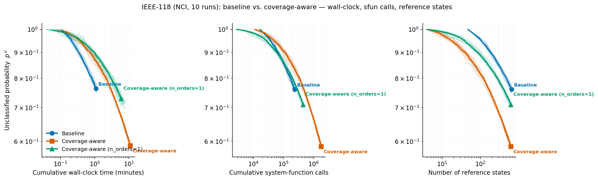

# Coverage-aware Stage-1 search on IEEE-118 — experiment summary

**For:** co-authors (Byun / Ryu / Song), RSR manuscript STRUCS-D-26-00220
**Purpose:** evidence for the response to Reviewer 3 (Comments 3.1 / 3.2) and,
by extension, the scalability discussion raised in Comments 1.7 and 2.2.
**Figure:** `cov_ab_nci/ieee118_coverage_nci.png` (this directory).
**Data:** 10 independent runs per variant on NCI Gadi (`cov_ab_nci/`).

---

## TL;DR

Reviewer 3.2 suggested making Stage-1 boundary search *coverage-aware* — pick
new reference states that classify as much of the remaining unclassified sample
pool as possible — as a way to reduce the number of reference states RSR needs
on hard problems. We implemented it and ran a 10-run A/B study on the IEEE-118
blackout case on NCI Gadi (2× V100, 48 CPU workers).

**It works, with a trade-off that parallelisation makes mild:**

- Coverage-aware reaches a given unclassified probability `p^u` with
  **~3.9× fewer reference states** at the full setting (n_orders = 4), or
  ~1.6× fewer at the cheaper setting (n_orders = 1).
- The cost is ~8× more system-function (DC-OPF) evaluations — but because those
  extra evaluations are embarrassingly parallel, the **wall-clock** penalty to
  reach the same coverage is only **~2.6×** (2.8 vs 1.1 min on a Gadi GPU node).
- Run-to-run variation is small (coefficient of variation 0.8–11 %), consistent
  with the robustness shown in Table 8.

So it is a genuine improvement on the axis the reviewers care about (number of
reference states = the R_max scalability wall), at a modest wall-clock cost. It
does **not** make IEEE-118 converge to `p^u → 0`, but it pushes the
reference-count wall out by ~3.9×.

---

## What was run

- **Problem:** IEEE-118 DC-OPF blackout, 304 components (54 generator buses at
  4 states, 64 ordinary buses + 186 branches at 2 states), system fails when
  the blackout exceeds 13.8 % of demand. Identical to the Section-4.3 setting.
- **Platform:** NCI Gadi, `gpuvolta` (2× V100 GPUs for sampling/classification,
  48 CPU worker processes for the system-function evaluations + minimisations).
- **RSR settings:** 100,000 Monte-Carlo samples per round, each variant run to
  **640 reference states**, **10 independent repetitions** per variant.
- **Variants:**
  - **Baseline** — the current Stage-1: one random coordinate order per
    unclassified seed (componentwise binary search). ~48 references/round on
    48 workers, so it reaches 640 references in ~14 rounds.
  - **Coverage-aware (n_orders = k)** — for each unclassified seed, generate
    `k` candidate boundary states from `k` different random coordinate orders,
    score each by how many currently-unclassified samples it classifies, and
    greedily commit the candidates with the largest *marginal* coverage (up to
    4 per round, from 8 seeds). The candidate minimisations are farmed out to
    the worker pool. We tested `k = 1` (isolates the greedy multi-seed
    *selection* effect) and `k = 4` (adds coordinate-order *diversity*).

Independently reproduced by the earlier single-run pair in `./out/` and by the
local `n_workers = 4` runs — same trend, same magnitude.

---

## Results (10 runs, medians)

### Unclassified probability `p^u` at matched reference counts

Lower is better. At **every** reference count the ordering is
baseline > (n_orders=1) > (n_orders=4), monotone in `n_orders`, confirming the
mechanism is real rather than sampling noise.

| # reference states | Baseline | Coverage-aware (n=1) | Coverage-aware (n=4) |
|---:|---:|---:|---:|
| 40  | 1.000 | 0.948 | **0.901** |
| 80  | 0.959 | 0.904 | **0.842** |
| 160 | 0.900 | 0.851 | **0.765** |
| 240 | 0.878 | 0.816 | **0.717** |
| 320 | 0.841 | 0.787 | **0.678** |
| 480 | 0.803 | 0.746 | **0.623** |
| 640 | 0.761 | 0.710 | **0.586** |

### Cost to reach the same coverage (`p^u = 0.769`, baseline's endpoint)

Median over 10 runs, coefficient of variation in parentheses.

| Variant | Reference states | System-function calls | Wall-clock |
|---|---:|---:|---:|
| Baseline | 624 (5.0 %) | 2.19 × 10⁵ (5.0 %) | 1.09 min (5.6 %) |
| Coverage-aware (n=1) | 382 (**1.6× fewer**, 5.4 %) | 2.68 × 10⁵ (1.2× more) | 4.11 min (11 %) |
| Coverage-aware (n=4) | 160 (**3.9× fewer**, 6.2 %) | 4.49 × 10⁵ (2.0× more) | 2.82 min (5.7 %) |

**Key point — the wall-clock axis reverses the naïve reading of the cost.** On
raw system-function calls, n_orders=4 looks ~8× more expensive per round
(≈11,200 vs ≈1,400 calls/round). But to reach the *same coverage* it needs so
many fewer reference states (hence fewer rounds) that its wall-clock cost is
only ~2.6× baseline — and it is actually **faster than n_orders=1** in
wall-clock (2.82 vs 4.11 min), because the candidate minimisations run in
parallel across the 48 workers while the round count drops. After
parallelisation, **n_orders=4 is the better operating point on both the
reference-count axis and the equal-coverage wall-clock axis.**

### Figure

{width=100%}

The three panels share the `p^u` y-axis:
- **(left) vs. cumulative wall-clock time** — coverage-aware costs more, but
  modestly; n_orders=4 reaches lower `p^u` than n_orders=1 in comparable time.
- **(middle) vs. cumulative system-function calls** — baseline most efficient
  per call; coverage-aware curves shift right.
- **(right) vs. number of reference states** — coverage-aware curves sit below
  baseline everywhere (fewer references for the same coverage).

---

## Why this happens (connects to Comment 3.1)

On IEEE-118 the minimised boundary reference states are large: **146–199
non-trivial component conditions each (median 173 of 304)**. Each such
reference classifies only a small slice of probability, which is precisely why
the problem needs on the order of 10⁵ reference states (the paper's own
finding). The componentwise binary search always lands in that 146–199 band
regardless of coordinate order, so the *length* of a reference is not what
coverage-aware selection changes.

What it does change is *which* boundary, among several valid ones, gets added:
different coordinate orders reach different local boundaries that cover
different amounts of the unclassified region, and greedily keeping the
highest-coverage one front-loads the reference states that matter. This is
exactly the "coordinatewise-local vs. globally-maximal boundary" distinction
Reviewer 3 raised in Comment 3.1 — and the experiment quantifies how much it is
worth in practice.

---

## Algorithmic lineage (for citation)

The two ingredients are standard combinatorial-optimisation heuristics; we cite
them as the lineage of the method, not as an optimality proof for RSR.

- **Greedy batch selection = greedy maximum coverage.** Each round we add the
  batch of reference states that most reduces the unclassified sample pool,
  chosen by largest *marginal* coverage. Pool coverage is a monotone submodular
  set function, so this is the classical greedy max-(k-)cover heuristic, which
  attains a `(1 − 1/e) ≈ 0.63` fraction of the optimal batch coverage
  (Nemhauser, Wolsey & Fisher 1978; Feige 1998); see Krause & Golovin (2014)
  for a tutorial treatment.
- **Multiple coordinate orders, keep the best = randomized-greedy multi-start.**
  Generating candidate boundaries by re-running the componentwise greedy
  minimiser under different random component orderings and retaining the
  highest-coverage one is a randomized-greedy construction in the spirit of
  GRASP (Feo & Resende 1995).

**Scope of the guarantee.** The `(1 − 1/e)` bound applies to a *single round's*
batch selection from a *fixed* candidate pool, evaluated on the *Monte-Carlo*
unclassified sample (i.e. a sampled, probability-weighted max-coverage). It is
not a statement about the full multi-round loop or the true probability mass —
it explains why the per-round selection is sound, nothing more.

```bibtex
@article{nemhauser1978,
  author  = {Nemhauser, G. L. and Wolsey, L. A. and Fisher, M. L.},
  title   = {An analysis of approximations for maximizing submodular set functions---I},
  journal = {Mathematical Programming},
  volume  = {14}, number = {1}, pages = {265--294}, year = {1978},
  doi     = {10.1007/BF01588971}
}
@article{feige1998,
  author  = {Feige, Uriel},
  title   = {A threshold of ln n for approximating set cover},
  journal = {Journal of the ACM},
  volume  = {45}, number = {4}, pages = {634--652}, year = {1998},
  doi     = {10.1145/285055.285059}
}
@article{feo1995,
  author  = {Feo, Thomas A. and Resende, Mauricio G. C.},
  title   = {Greedy randomized adaptive search procedures},
  journal = {Journal of Global Optimization},
  volume  = {6}, number = {2}, pages = {109--133}, year = {1995},
  doi     = {10.1007/BF01096763}
}
@incollection{krause2014,
  author    = {Krause, Andreas and Golovin, Daniel},
  title     = {Submodular Function Maximization},
  booktitle = {Tractability: Practical Approaches to Hard Problems},
  publisher = {Cambridge University Press}, pages = {71--104}, year = {2014}
}
```

---

## Draft text for the response (to adapt)

> Following the reviewer's suggestion (Comment 3.2), we implemented a
> coverage-aware variant of the Stage-1 search: for each unclassified seed we
> generate several candidate boundary states under different coordinate orders,
> estimate the fraction of the remaining unclassified samples each would
> classify, and greedily retain the highest-coverage candidates. On the
> IEEE-118 benchmark (ten independent runs), this reduces the number of
> reference states required to reach a given unclassified probability by up to a
> factor of ~3.9 (median 160 versus 624 reference states to reach `p^u = 0.77`).
> Although each round performs more system-function evaluations, these are
> independent and run in parallel, so the wall-clock cost of reaching the same
> coverage increases only by about a factor of 2.6. This confirms the reviewer's
> intuition that boundary-state coverage — not merely coordinate order — governs
> how many reference states are needed (Comment 3.1), and provides a concrete
> lever for the large-network regime discussed in Section 5. The number of
> coordinate orders tried per seed tunes the trade-off between reference-state
> economy and computational cost.

Note we can frame this as either (a) a new subsection/result, or (b) a reported
investigation that supports keeping the fuller coverage-aware strategy as future
work — depending on how much scope you want to add to the revision.

---

## Caveats to be aware of before we cite numbers

1. **Trade-off is problem-dependent.** For DC-OPF the system function is the
   expensive part, so the extra evaluations are real; the wall-clock premium
   (~2.6×) depends on having enough workers to absorb the parallel candidate
   minimisations. On a single core the premium would be closer to the ~8×
   system-function-call ratio.
2. **Not full convergence.** IEEE-118 remains far from `p^u → 0` in 640
   references for all variants — consistent with the ~10⁵-reference scale of the
   problem. The claim is *relative* (fewer references for the same coverage),
   not that coverage-aware makes IEEE-118 converge.
3. **`p^u` is a Monte-Carlo estimate** from 100,000 samples per round; the
   run-to-run coefficient of variation (0.8–11 %) captures this and is small.

---

## Reproduction

On NCI Gadi (PBS), single job for all three variants (10 runs each):

```bash
cd demos/ieee118_blackout
qsub nci_gadi_coverage_ab.pbs      # baseline + cov_n1 + cov_n4, --runs 10 each
```

Equivalent direct calls (e.g. `--runs 10`, GPU node with 48 workers):

```bash
COMMON="--runs 10 --devices auto --n-workers 48 --max-refs 640 \
        --batch 100000 --unk-opt abs --unk-thres 1e-6"

python run_demo.py $COMMON --out cov_ab_nci/base
python run_demo.py $COMMON --coverage-aware --ca-n-orders 1 --ca-n-seeds 8 --ca-max-add 4 --out cov_ab_nci/cov_n1
python run_demo.py $COMMON --coverage-aware --ca-n-orders 4 --ca-n-seeds 8 --ca-max-add 4 --out cov_ab_nci/cov_n4

# 3-panel figure (wall-clock / system-function calls / reference states)
python ../plot_coverage_ab.py \
    --base cov_ab_nci/base --cov cov_ab_nci/cov_n4 \
    --variant "Coverage-aware (n_orders=1)=cov_ab_nci/cov_n1" \
    --out cov_ab_nci/ieee118_coverage_nci.png
```

Implementation: `rsr/coverage_search.py` (the coverage-aware round, with
pool-parallel candidate generation) wired into
`rsr/rsr.py::run_ref_extraction_by_mcs` behind `coverage_aware=` /
`ca_n_seeds` / `ca_n_orders` / `ca_max_add`, exposed as CLI flags in
`demos/blackout_lib.py`.
